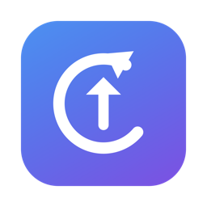

<p align="center"></p>

<h1 align="center">Datest</h1>

<p align="center"><em>One place to see — and install — updates for every app on your Mac.</em></p>

<p align="center">
  
  
  
</p>

A native macOS app that checks every installed application for available updates —
across Sparkle feeds, the Mac App Store, and the Homebrew catalog — and installs
them through Homebrew's checksum-verified downloads. Inspired by
[Latest by Max Langer](https://github.com/mangerlahn/Latest). Built with SwiftUI
and Swift Package Manager (no Xcode required, Command Line Tools are enough).

<!-- TODO: add docs/screenshot.png of the Updates window here -->

## Download

Get `Datest-x.y.z.dmg` from the [latest release](../../releases/latest), open it,
and drag **Datest** into Applications.

> **Note:** builds are ad-hoc signed (no Apple Developer ID), so on first launch
> macOS will warn that the app is from an unidentified developer. Right-click
> the app → **Open** → **Open**, or allow it under
> *System Settings → Privacy & Security*. If macOS reports the app as
> "damaged", clear the quarantine flag:
> `xattr -cr /Applications/Datest.app`
> Prefer not to trust a pre-built binary? Build from source below in under a
> minute.

## How it works

For every `.app` in `/Applications` and `~/Applications`:

1. **Sparkle apps** — if the app's `Info.plist` has an `SUFeedURL`, the appcast XML is
   fetched and the newest *stable* release is compared against the installed version.
   Items tagged with a `<sparkle:channel>` (beta/nightly) are ignored, as are
   prerelease-looking version strings when a stable one exists.
2. **App Store apps** — apps with an App Store receipt are looked up via the iTunes
   Lookup API by bundle ID. Only real Mac listings (`kind: mac-software`) count;
   many lookups return just the iOS listing, whose version numbering is unrelated
   to the Mac app's. Apps without a public Mac listing show "Updates through the
   App Store" — the App Store handles them itself.
3. **Everything else** — tried against the App Store first (only a real
   `mac-software` listing counts, so an iOS app sharing a bundle ID doesn't cause a
   false "update available"), then against the **Homebrew cask catalog**
   (formulae.brew.sh) — a community-maintained database of current versions for
   thousands of Mac apps. Homebrew itself doesn't need to be installed; the app
   matches your installed apps to casks by their `.app` filename. The ~25 MB
   catalog is cached in `~/Library/Caches/Datest/` for 24 hours.

A **menu bar icon** shows a count when updates are available; its menu lists them
(click one to install it), plus *Check Now* and *Open Datest*.

Only apps that publish no version data anywhere (e.g. VeraCrypt, Microsoft Teams)
end up under **No Update Info**.

## Installing updates and apps (Homebrew)

If Homebrew is installed, the **Update** button actually installs the update for
any app with a matching cask (except App Store installs, which should keep
updating through the App Store):

- Apps already managed by brew → `brew upgrade --cask <token>`
- Apps installed manually → `brew install --cask --force <token>`, which replaces
  the existing copy with brew's checksum-verified download and manages it from
  then on
- Up-to-date apps can be *adopted* (`--adopt`, right-click menu) so future
  updates flow through brew without reinstalling anything now
- **Update All** installs every brew-handleable update in one go; **Adopt All**
  (under ⋯) migrates all eligible apps. Operations run one at a time — brew
  can't run concurrently with itself.
- Casks that genuinely need admin rights trigger a native macOS password
  dialog (`SUDO_ASKPASS`); the password flows from the dialog straight to
  `sudo` and is never seen or stored by the app. Cancelling aborts cleanly.

The **Discover** panel searches the full Homebrew catalog (~7,000 apps) and shows:

- **Top Open Source Apps** — ranked by Homebrew's public 30-day install
  analytics, filtered to open-source projects
- **Recommended** — curated free apps, plus open-source apps already on this
  Mac with their Homebrew adoption state (each app appears in exactly one section)

Rows show real app icons for installed apps; otherwise the icon comes straight
from the vendor's site, or the project's GitHub avatar for GitHub-hosted apps —
no third-party icon service. GitHub-hosted projects get a GitHub link, and
everything installs with one click. Apps installed this way always get
one-click updates later.

Right-click any app in Updates to **ignore its updates** (e.g. a paid major
upgrade you're skipping) — it moves to an *Ignored* section and stops counting
toward the badge until you resume it.

## Security model

- **Version metadata is read-only** and fetched over HTTPS from three sources:
  Apple's iTunes API, Homebrew's `formulae.brew.sh` API, and each app's own
  Sparkle feed. App Transport Security is enforced (no plain-http exception), so
  a feed served over http simply fails closed into "No Update Info".
- **This app never downloads or executes app binaries itself.** All installs and
  updates are delegated to Homebrew, which downloads from the vendor URL pinned
  in the community-audited cask and verifies the SHA-256 checksum before
  installing.
- **No shell, no injection**: `brew` is executed directly with an argument
  array; cask tokens are validated against a strict character set first.
- **Non-interactive**: brew runs with `NONINTERACTIVE=1`, so a cask that would
  need an admin password fails with a visible error instead of prompting or
  hanging. Nothing runs as root.
- No analytics, no phoning home; the only local write is the catalog cache in
  `~/Library/Caches/Datest/`.

## Build & run

```sh
./scripts/make-app.sh    # builds release binary + icon, assembles build/Datest.app
open build/Datest.app
```

To keep it around, drag `build/Datest.app` into `/Applications`.

### Headless check from the terminal

```sh
swift build
.build/debug/Datest --check
```

Prints a table of every scanned app with `↑` (update available), `✓` (up to date),
or `?` (no update info), and a summary count.

## Project layout

| File | Purpose |
|---|---|
| [Main.swift](Sources/Datest/Main.swift) | Entry point; GUI by default, `--check` for CLI mode |
| [AppScanner.swift](Sources/Datest/AppScanner.swift) | Finds installed apps, reads Info.plist / receipts |
| [UpdateChecker.swift](Sources/Datest/UpdateChecker.swift) | Sparkle appcast parsing + iTunes Lookup API + Homebrew fallback |
| [HomebrewIndex.swift](Sources/Datest/HomebrewIndex.swift) | Cached Homebrew cask catalog, matched by .app filename |
| [BrewService.swift](Sources/Datest/BrewService.swift) | Runs brew install/upgrade/adopt safely (no shell) |
| [UpdaterModel.swift](Sources/Datest/UpdaterModel.swift) | Observable state, concurrency-limited checking |
| [ContentView.swift](Sources/Datest/ContentView.swift) | Sidebar, updates list, per-app update actions |
| [DiscoverView.swift](Sources/Datest/DiscoverView.swift) | Catalog search, recommended apps, installs |
| [Models.swift](Sources/Datest/Models.swift) | Data types + version comparison |
| [scripts/make-app.sh](scripts/make-app.sh) | Builds and assembles the .app bundle |
| [scripts/render-icon.swift](scripts/render-icon.swift) | Draws the app icon with AppKit |

## Notes

- The bundle is ad-hoc signed, fine for local use. Distributing it to other Macs
  would need a Developer ID certificate and notarization.
- The iTunes Lookup API is unauthenticated and rate-limited; checks run at most
  6 at a time to stay under the limit.
- Headless catalog search: `.build/debug/Datest --search <query>`.
